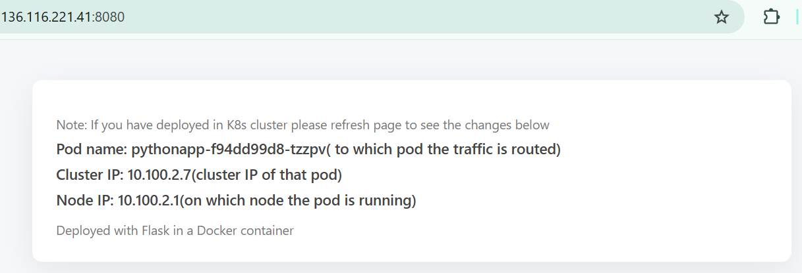

# Python App — Kubernetes Deployment

## Prerequisites
- A Kubernetes cluster (at least 1 control plane and 2 worker nodes)
- kubectl configured to talk to the cluster
- (Optional) A namespace to deploy into

## Deploy the application
1. Create the Deployment:
```bash
kubectl create deploy <deployment-name> --image=krishnasecops/pythonapp:1.0 -n <namespace>
```

2. Expose the Deployment via a LoadBalancer service on port 8080:
```bash
kubectl expose deploy <deployment-name> --type=LoadBalancer --port=8080 -n <namespace>
```

3. Wait until the service gets an external IP, then check services:
```bash
kubectl get svc -n <namespace>
```

4. Open the app in your browser:
```
http://<EXTERNAL-IP>:8080
```

## Notes
- If you are using a local cluster (minikube, kind), LoadBalancer may not provision an external IP. Use `minikube service <service-name> -n <namespace>` or port-forwarding instead:
```bash
kubectl port-forward deploy/<deployment-name> 8080:8080 -n <namespace>
# then open http://localhost:8080
```

## Screenshot

